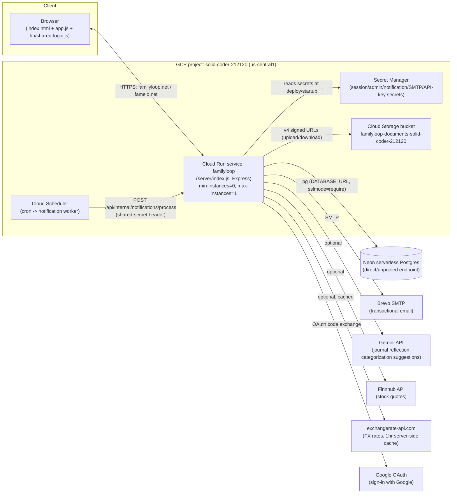

# FamilyLoop — Architecture (High-Level Design)

This document is the "take over this app" HLD: what runs where, how the pieces
talk to each other, and why the system looks the way it does. For endpoint-level
and schema-level detail, see [LLD.md](LLD.md). For day-2 operational procedures,
see [SOPS.md](SOPS.md).

## 1. System context

FamilyLoop is a single-tenant-per-household SaaS: budgeting, calendar/chores,
notes, meals, documents, shared expenses/IOUs, wealth tracking, and reports,
shared across the members of a household and (for some modules) across a
user's several households.

## 2. Tech stack

| Layer | Choice | Notes |
|---|---|---|
| Frontend | Plain HTML/CSS/JS, no framework, no build step | `index.html`, `app.js` (~11k lines), `styles.css` (~6.3k lines) |
| Shared logic | `lib/shared-logic.js` (~1.5k lines) | Pure functions, loaded as a second `<script>` tag by the browser **and** `require()`'d by `server/index.js` and the test suite — one implementation, three consumers |
| Backend | Node.js + Express | `server/index.js` (~3.6k lines), single process, no framework beyond Express itself |
| Database | PostgreSQL | Currently **Neon** (serverless, direct/unpooled endpoint — see [§5](#5-database) for why not pooled); `pg` driver |
| Object storage | Google Cloud Storage | Uploaded documents; v4 signed URLs, never proxied through the app server |
| Auth | Cookie session (`hh_session`, signed via `cookie-parser` + `SESSION_SECRET`) + bcrypt password hashing, or Google OAuth | 30-minute idle timeout |
| Email | Nodemailer over SMTP (Brevo free tier in production) | JSON-preview transport when `SMTP_HOST` is unset (local dev) |
| Container | Docker, `node:20-bookworm-slim`, non-root, read-only-friendly | `Dockerfile` |
| Compute | **Cloud Run** (current) | Scale-to-zero: `min-instances=0`, `max-instances=1`, 1 vCPU / 512Mi |
| Secrets | GCP Secret Manager | One enabled version kept per secret; billed per enabled version/month |
| Scheduled jobs | Cloud Scheduler → `POST /api/internal/notifications/process` | Guarded by a shared secret (`NOTIFICATION_SECRET`), not a user session |
| Tests | Node's built-in `node --test` + Playwright | 308 `node --test` tests across unit (`shared-logic.test.js`) + integration (`test/*.integration.test.js`), an in-memory `MEMORY_DB=true` mode stands in for Postgres; plus a Playwright browser-level UI suite (`test/ui/`, `npm run test:ui`) that logs in as the demo user and loads every authenticated screen, failing on any console/page error — the only layer that catches a `render()`-time client-side crash |

## 3. Deployment topology — current vs legacy

Production has moved through three topologies. Only the last one is live today;
the earlier two are described here because their scripts/manifests are still in
the repo and it's easy to mistake them for current.

1. **GKE (legacy, retired)** — `scripts/deploy-gke.sh` + `k8s/*.yaml`. A
   zonal GKE cluster running the app pod plus an in-cluster PostgreSQL
   StatefulSet. Superseded because an always-on GKE node + load balancer cost
   far more than the app's actual traffic justified.
2. **Cloud Run + Cloud SQL (legacy, retired)** — first cost-reduction step:
   moved compute to Cloud Run (scale-to-zero) but kept a managed Cloud SQL
   Postgres instance, which is itself an always-on cost.
3. **Cloud Run + Neon (current, live)** — `scripts/deploy-cloud-run.sh` with
   `DATABASE_URL` set skips Cloud SQL provisioning entirely
   (`USE_CLOUD_SQL=false` branch) and connects to an external Neon Postgres
   instance instead, which autosuspends when idle. This is the cheapest
   topology that's been run and is what's live at `familyloop.net` /
   `famelo.net` today.

`scripts/migrate-gke-postgres-to-cloud-sql.sh` was the one-time helper for
step 1→2 and is no longer part of the deploy path. See
[SOPS.md](SOPS.md#deploying) for the actual current deploy command.

## 4. Request lifecycle — hybrid sync model

Most of the app's data (budget, calendar, notes, chores, meals, goals,
transfers, recurring expenses, wealth, decisions, etc.) lives in **one JSON
blob per household** (`households.app_state`, shape defined by
`server/default-state.js`), synced wholesale:

- `GET /api/state` — load the whole blob for the active household.
- `PUT /api/state` — the client's `autosaveState()` debounces edits ~350ms
  and PUTs the entire blob back. `saveStateNow()` is the non-debounced flush
  used before navigation/unload.

This is deliberate, not incidental: it keeps client code simple (one `state`
object, no per-field API calls) at the cost of larger payloads and a
last-write-wins concurrency model (see [SOPS.md](SOPS.md#known-risk-household-switch-race)
for the one known race condition this trades away).

Everything **outside** that shared blob is a normal per-feature REST endpoint
instead — auth, households/membership, documents (which stream through GCS
via signed URLs, not through the blob), per-user private data (journal/plans,
deliberately **not** in the shared blob — see §6), push device registration,
reports export, bank-statement parsing, stock quotes, and admin. See
[LLD.md](LLD.md#3-server-routes) for the full endpoint table.

## 5. Database

Postgres (Neon) holds: `users`, `households`, `household_memberships`,
`household_invitations`, `user_shared_modules`, `login_events`,
`password_reset_tokens`, `email_verification_tokens`, `notification_jobs`,
`push_devices`, `user_private_data`, `document_folders`, `documents`. Full
column-level detail is in [LLD.md](LLD.md#1-database-schema).

**Why the direct (non-pooled) Neon endpoint, not `-pooler`**: Neon's pooled
endpoint (PgBouncer) does not honor `ALTER ROLE/DATABASE ... SET search_path`
and rejects `options=-c search_path=...` in the connection string outright.
The app relies on the default `search_path` resolving to `public`; the direct
endpoint does this correctly, the pooled one does not. This cost a production
outage during the Neon migration cutover — see [SOPS.md](SOPS.md#incident-playbooks)
if this ever needs re-diagnosing.

## 6. Data isolation model

Three distinct isolation levels exist, easy to conflate:

1. **Household-scoped** (the default): most of `app_state` — budget,
   calendar, chores, meals, transfers. Visible only to members of that one
   household.
2. **Owner-shared across a user's households** (`user_shared_modules`,
   keyed by `owner_user_id` not `household_id`): Decisions and Documents are
   family-wide for a user, not per-household — a user with two households
   sees the same Documents/Decisions regardless of which household is
   currently selected. This was a deliberate design correction; see
   `documents-shared.integration.test.js` / `decisions.integration.test.js`.
3. **Per-user private** (`user_private_data`): Journal and Plan/daily-timeline
   data. Explicitly never written into the shared household blob or the
   shared-modules table — one person's journal entries must never become
   visible to another household member just because they share a household.

## 7. Background/async work

- **Notification worker**: `notification_jobs` rows are created when the
  client saves state containing reminders (chores, bills, birthdays). Cloud
  Scheduler calls `POST /api/internal/notifications/process` on a fixed
  cadence; the handler claims due, unclaimed jobs (`claimed_at`/`attempts`
  columns implement a simple claim-and-retry pattern), sends the
  email/push, and marks them sent. Guarded by `NOTIFICATION_SECRET`, not a
  user session, since the caller is Cloud Scheduler, not a logged-in user.
- **Documents**: uploads/downloads never proxy through the Express process —
  the client gets a v4 signed GCS URL from the API and talks to GCS directly.
  The DB row (`documents`) tracks metadata only (`storage_object`, size,
  content type, who/when opened).
- **Reports export**: synchronous — `POST /api/reports/export` builds an
  `.xlsx` (via `exceljs`) including rasterized SVG charts, in the same
  request/response cycle. No queue.

## 8. Client architecture (brief — see LLD for detail)

Single-page, no client router beyond a hash mirroring the current view.
`render()` (`app.js`) swaps `#view`'s `innerHTML` per navigation — a full
re-render per view change, not a virtual-DOM diff. All modals are native
`<dialog class="app-dialog">` elements. See
[LLD.md](LLD.md#4-client-architecture) for the render/state/dialog
conventions in detail, and the full list of feature `render*()` entry points.
