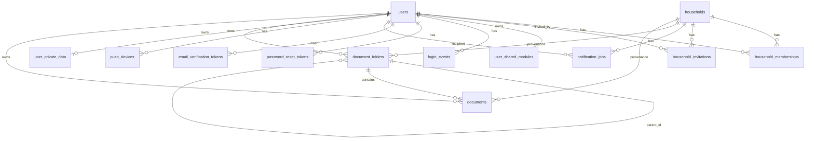

# FamilyLoop — Low-Level Design

Companion to [ARCHITECTURE.md](ARCHITECTURE.md) (which covers the "why" and
the system-level view). This is the "where exactly is it" reference: schema,
every route, client render/state conventions, the shared pure-function
catalog, and a walkthrough of the trickier algorithms in the codebase.

## 1. Database schema

`server/schema.sql`, applied idempotently (`CREATE TABLE IF NOT EXISTS` +
`ALTER TABLE ADD COLUMN IF NOT EXISTS`) on every server start — there is no
separate migration runner or migration-numbering scheme; schema changes are
additive `ALTER`s appended to the same file over time.



| Table | Purpose | Notable columns |
|---|---|---|
| `users` | Account record | `is_admin`, `google_id` (nullable — Google-auth accounts have no `password_hash`), `email_verified_at`, `default_household_id`, `phone`/`carrier` (for SMS-gateway reminders) |
| `households` | One row per household; **the JSON blob** | `app_state JSONB` — everything in [ARCHITECTURE.md §4](ARCHITECTURE.md#4-request-lifecycle--hybrid-sync-model), `invite_code` |
| `household_memberships` | User↔household join | `role` (`owner`/invited role), `scopes JSONB` (fine-grained feature access for non-owners) |
| `household_invitations` | Pending invites | `UNIQUE(household_id, email)`, `invite_code`, `status` |
| `user_shared_modules` | Per-user (not per-household) JSON store | Backing store for Documents/Decisions being visible across all of one user's households — see [ARCHITECTURE.md §6](ARCHITECTURE.md#6-data-isolation-model) |
| `login_events` | Append-only login log | Feeds admin stats (`GET /api/admin/monthly-stats`) |
| `password_reset_tokens` / `email_verification_tokens` | One-time token flows | `token_hash` (never store the raw token), `expires_at`, `used_at` |
| `notification_jobs` | Reminder delivery queue | `due_at`, `sent_at`, `claimed_at`/`attempts`/`last_error` (claim-and-retry for the worker), `UNIQUE(household_id, source_type, source_id, recipient_email, due_at)` prevents duplicate reminders on repeated state saves |
| `push_devices` | Web/mobile push tokens | Upserted by `token` |
| `user_private_data` | Journal + Plan data, one row per user | `journal JSONB`, `plans JSONB` — never merged into `households.app_state` |
| `document_folders` / `documents` | Documents feature | `owner_user_id` (drives cross-household sharing), `household_id` kept only as provenance (`ON DELETE SET NULL`, not `CASCADE` — deleting a household must not delete the owner's files), `storage_object` (GCS key), `note_id`/`wealth_item_id`/`wealth_item_type` (optional links to a Note or a Wealth account/liability), `last_opened_by`/`last_opened_at` |

## 2. server/index.js structure

- **Setup** (~line 5-138): `cookie-parser`, per-route body-size overrides
  (`/api/private-data/journal` 10mb, `/api/bank-statement` 15mb,
  `/api/reports` 20mb, default 1mb), `express.static` on the repo root.
- **Postgres `Pool`** (~line 103-113): branches on `CLOUD_SQL_CONNECTION_NAME`
  — if set, connects via the Cloud SQL Unix socket (legacy path); otherwise
  uses `DATABASE_URL` + `DATABASE_SSL` (current Neon path,
  `ssl: {rejectUnauthorized: false}`). A `memoryDb` object stands in for
  Postgres entirely when `MEMORY_DB=true` (used by the test suite and
  `npm run preview`).
- **Auth**: cookie `hh_session`, signed with `SESSION_SECRET`
  (`cookie-parser`), 30-minute idle timeout (`SESSION_IDLE_MS`). Passwords via
  `bcrypt` (cost 12), with a `bcryptjs` pure-JS fallback. Middlewares:
  `requireSession`, `requireAdmin`, `requireNotificationSecret` (checks a
  bearer/shared-secret header for the Cloud Scheduler callback — not tied to
  any user session).

## 3. Server routes

| Area | Method & Path | Auth |
|---|---|---|
| Health | `GET /healthz` | public |
| | `GET /readyz` (DB-aware — this is what deploy health-checks poll) | public |
| Misc | `GET /api/countries` | public |
| AI | `POST /api/journal/reflection` (Gemini) | session |
| | `POST /api/transactions/suggest-subcategory` (Gemini) | session |
| | `GET /api/stock-quote` (Finnhub) | session |
| Auth | `GET /api/session` | public |
| | `PATCH /api/auth/me` | session |
| | `POST /api/auth/signup` | public |
| | `POST /api/auth/signin` | public |
| | `POST /api/auth/google` | public |
| | `POST /api/auth/password-reset/request` / `/confirm` | public |
| | `POST /api/auth/verify-email/confirm` | public |
| | `POST /api/auth/verify-email/resend` | session |
| | `POST /api/auth/invitations/accept` | public |
| | `POST /api/auth/demo` | public |
| | `POST /api/auth/signout` | public |
| Admin | `GET /api/admin/session` / `/stats` / `/monthly-stats` / `/users`, `PATCH /api/admin/users/:id` | admin |
| Households | `GET/POST /api/households`, `POST /select`, `POST /default`, `POST /invitations`, `GET/DELETE /access`, `DELETE /:id` | session |
| Calendar | `GET /api/calendar/members` | session |
| Friends | `POST /api/friends/invite` | session |
| **State blob** | `GET /api/state`, `PUT /api/state` | session |
| Private data | `GET /api/private-data`, `PUT /journal`, `PUT /plans` | session |
| Push | `POST /api/push-devices` | session |
| Documents | `GET /api/documents`, folder CRUD, `POST /upload-url`, `POST /:id/confirm`, `GET /:id/download-url`, `POST /:id/open`, `POST /:id/copy`, `DELETE /:id`, `PATCH /:id` | session |
| Bank import | `POST /api/bank-statement/parse-pdf` | session |
| Reports | `POST /api/reports/export` | session |
| Notifications | `POST /api/internal/notifications/process` | shared-secret (Cloud Scheduler only) |
| Test-only | `GET /api/test/notification-jobs`, `GET /api/test/push-devices` | test-mode gated |
| Fallback | `GET /*` → `index.html`; global error handler | — |

## 4. Client architecture

- **View dispatch**: `views` (ordered `[key, label, icon]` tuples) drives the
  nav; `renderers` maps each key to a `render<Feature>()` function;
  `currentView` is the single source of truth. `render()` sets
  `view.innerHTML` to the current view's output — a full re-render per
  navigation, not a virtual-DOM diff.
- **Routing**: a single hash segment (`#budget`, `#reports`, ...) mirrors
  `currentView` for bookmarkability/back-button support via one `popstate`
  listener. There is no per-view parameter parsing.
- **State/sync**: `state` (global) holds the entire household JSON blob.
  `autosaveState()` debounces ~350ms then `PUT /api/state`; `saveStateNow()`
  is the immediate-flush variant used before navigation/unload. Two more
  globals follow the same debounced-autosave pattern against their own
  endpoints: `privateData` → `autosaveJournal()`/`autosavePlans()` →
  `PUT /api/private-data/journal|plans` (deliberately never merged into
  `state` — see [ARCHITECTURE.md §6](ARCHITECTURE.md#6-data-isolation-model)).
- **Dialogs**: native `<dialog class="app-dialog">` + `.showModal()`/
  `.close()` — no custom modal framework. Some are static in `index.html`
  (`householdDialog`, `deleteBudgetLineDialog`, `exportReportDialog`,
  `assignIouDialog`, `moveToTransferDialog`, `settleUpDialog`, ...), others
  are injected from `app.js` when first needed (e.g. `noteLabelsDialog`).
  New dialogs/toasts should follow this same convention rather than
  introducing a new one.
- **Major feature entry points** (`app.js`): `renderHome`, `renderBudget`,
  `renderTransactions`, `renderPaychecks`, `renderCalendar`, `renderNotes`,
  `renderJournal`, `renderPlan`/`renderDailyPlan` (drag/resize daily
  timeline), `renderDocuments`, `renderDecisions`, `renderIOUs`
  (shared expenses/settle-up), `renderMeals`, `renderRecipes`, `renderGoals`,
  `renderWealth` (net worth/accounts), `renderSharing`, `renderReports`
  (Sankey/tags/category/net-worth-trend charts), `renderProfile`,
  `renderHelp`, `renderAdmin`.

## 5. lib/shared-logic.js — function catalog

Grouped by domain; every function here is pure (no DOM, no network, no
mutation of its arguments) so it can be unit-tested directly and shared
byte-for-byte between the browser, the server, and the test suite.

- **Checklists/notes**: `applyChecklistToggle`, `bucketChecklistItems`,
  `findChecklistDuplicate`, `moveChecklistItem`.
- **Meal/plan**: `mealWeeksForMonth`, `groupPlanTasksByBucket`,
  `validateJournalPayload`.
- **Daily recurring tasks**: `dailyTaskOccursOnDate`,
  `isDailyTaskDoneOnDate`, `toggleDailyTaskDoneOnDate`.
- **Timeline math**: `timeToMinutes`, `minutesToTime`, `snapMinutes`,
  `layoutTimelineBlocks`, `comparePlannedToActual`.
- **Documents**: `sanitizeFilename`, `buildDocumentObjectPath`,
  `wouldCreateFolderCycle`, `buildFolderTree`.
- **Notifications**: `SMS_CARRIERS`, `smsGatewayAddress`.
- **Recurrence/dates**: `paycheckOccurrencesSince`,
  `paycheckOccurrencesInRange`, `paycheckAllOccurrenceDatesInRange`,
  `recurringExpenseOccurrenceDates`, `accountBalance`,
  `accountsWithBalances`, `formatDateKeyFromDate`,
  `isChoreOccurrenceComplete`, `isChoreOccurrencePendingFor`,
  `nextPendingChoreOccurrence`, `currentChoreOccurrenceDate`,
  `zonedTimeToUtcIso`, `choreNotifyAt`, `CHORE_MONTH_STEP_BY_RECURRENCE`,
  `annualEventDate`, `nextAnnualEventDate`, `annualEventNotifyAt`,
  `rollAnnualNotifyAtForward`.
- **Shared expenses/IOUs**: `splitAmountEvenly`, `splitBillByPercentages`,
  `splitBillByShares`, `normalizePersonName`, `netBalancesByPerson`,
  `computeBillSplitAmounts`, `settleUpPersonIous`, `isValidEmail`.
- **Bank import & matching**: `parseDelimitedText`,
  `parseBankCsvTransactions`, `parseCreditCardStatementText`,
  `parseCheckingAccountActivityText`, `parseBankStatementPdfText`,
  `normalizeForAccountMatch`, `matchAccountByFilename`,
  `isDuplicateTransaction`, `findTransferCandidate`, `orderRefundMatch`,
  `normalizeForPayeeMatch`, `payeesFuzzyMatch`, `refundFuzzyMatch`,
  `refundMatch` (see [§6](#6-key-algorithms) for how the refund-matching
  chain actually works), `suggestSubcategoryFromHistory` (an
  exact-normalized-payee match against already-categorized transactions -
  deliberately no fuzzy fallback, unlike `refundMatch`/`payeesFuzzyMatch`:
  a first version tried the same prefix-fuzzy heuristic, but on payee text
  alone (no corroborating amount+date window the way refund pairing has)
  it collapsed unrelated transactions sharing only a generic prefix -
  "Zelle payment to X" vs "Zelle payment from Y" - onto whichever one
  happened to be categorized most recently, a real incident that
  mis-suggested the same wrong subcategory across a whole statement
  import; Bank Stream has a "Clear N suggested subcategories" recovery
  action, scoped to exactly the drafts flagged `historyMatch`, for exactly
  this failure mode. The single most-recently-categorized transaction for
  an exact payee match still wins outright over a line with more total
  hits, so a household that changed how it categorizes a payee gets the
  newer choice immediately) — the free, local, no-API-call first pass Bank
  Stream and the manual Add transaction form both try before ever falling
  back to `/api/transactions/suggest-subcategory`'s Gemini call, which is
  deliberately never triggered automatically across a whole import - only a
  single explicit per-row/per-form button click, so a 200-row statement
  import can't turn into 200 paid API calls. `suggestAccountFromHistory`
  mirrors `suggestSubcategoryFromHistory` exactly (same exact-payee-match-
  only rule, no fuzzy fallback, deliberately applying the lesson from that
  incident from the start) but for which Wealth account a payee's
  transactions have actually been linked to; its own AI fallback,
  `/api/transactions/suggest-account`, mirrors `/api/transactions/suggest-
  subcategory`'s validation/prompt/hallucination-guard shape as well, and is
  wired into Bank Stream (an "Account from history" pill, falling back to a
  per-row ✨ button only when the whole-file `matchAccountByFilename`/
  `matchAccountByHints` match came up empty for that import) and the manual
  Add transaction form (a `transactionFormAccountTouched` flag mirroring
  `transactionFormLineTouched`, so it doesn't fight a manual pick). `parseBankStatementPdfText` auto-detects a
  checking/deposit account's "Account Activity" print export (e.g. Bank of
  America's Online Banking print-to-PDF — a Posting date/Description/Type/
  Amount/Available balance table, with a still-pending row showing
  "Processing" instead of a date) vs. a credit-card monthly statement from
  the extracted text's own column-header signature, and delegates to
  whichever of the other two matches; `/api/bank-statement/parse-pdf` calls
  this dispatcher rather than `parseCreditCardStatementText` directly.
  `parseBankCsvTransactions`'s header/format detection was hardened after
  testing real institutions' own export column names (Chase's "Posting
  Date", Discover's "Trans. Date"/"Post Date") and a headerless
  five-column Wells Fargo format that has no header row to key off at all
  (recognized structurally: every row has 5 fields, the first two parse as
  a date and a number); its credit-card-vs-checking sign detection also now
  treats any "...payment...thank you"/"online payment"-style negative
  description as a strong signal on its own, since a small file with a
  tied purchase-vs-payment count (a perfectly ordinary partial-month Amex
  or Discover export) used to fall back to checking-style and come out
  with every row's sign backwards.
- **Tags**: `normalizeTag`, `groupTransactionsByTag`.
- **Budgeting/reports math**: `monthKeysInRange`, `spentByLineInMonth`,
  `recurringBudgetSetAside`, `nextRecurringBudgetDueDate`,
  `monthsUntilDueInclusive`, `monthEndDateKey`, `assetValue`,
  `computeTrailingMonthKeys`, `computeReportCategoriesForScope`,
  `computeNetWorthAtDate`, `computeNetWorthTrend`, `computeCashFlowByMonth`,
  `sankeyFlowSegments` (the last seven were extracted from app.js
  specifically to get them under unit test — see the note below).

**Extraction note**: app.js has zero measured test coverage of its own — it
only ever runs in the browser, never under `node --test` — so pure
calculation logic that used to live there (reading `state` implicitly) is
being moved into shared-logic.js as parameterized functions and unit
tested, following the same pattern already established for everything else
in this file. `reportCategoriesForScope`, `trailingMonthKeys`,
`netWorthAtDate`, `netWorthTrend`, and `cashFlowByMonth` still exist in
app.js as one-line wrappers under their original names/signatures (so every
existing render-function call site is untouched) that just delegate to the
new `compute*`-prefixed shared-logic.js implementations. The `compute`
prefix is required, not stylistic: app.js and shared-logic.js are separate
`<script>` tags sharing one global scope, so a shared-logic.js function
with the *same* name as an app.js function would silently shadow it
depending on script load order instead of throwing (a real bug class in
this codebase — a duplicate top-level name breaks the app and
`node --check` won't catch it, since each file is syntactically valid on
its own). `monthEndDateKey`, `assetValue`,
and `sankeyFlowSegments` had no such collision (identical signature, or
call sites already used the bare name with no local app.js definition left
behind) and were moved outright with no wrapper. Continuing this pattern
for the rest of app.js's calculation functions (budget-vs-actual, home
dashboard reminders, etc.) is the natural next step for closing the
coverage gap further.

## 6. Key algorithms

### 6.1 Refund/return matching (`refundMatch`)

Goal: when a Bank Stream import row is a refund (negative amount), find the
original purchase so the refund nets against the same budget line instead of
landing unassigned.

```
refundMatch(candidate, pool):
    return orderRefundMatch(candidate, pool) || refundFuzzyMatch(candidate, pool)
```

1. **`orderRefundMatch`** — exact `orderNumber` match against a positive-amount
   transaction in the pool. Strongest signal (two unrelated purchases could
   coincidentally share a payee/amount, but not a real order id), tried
   first.
2. **`refundFuzzyMatch`** — fallback, used whenever the order-number match
   comes up empty (not only when the candidate has no order number at all —
   a purchase and its refund don't always carry the same order id on both
   statement lines). Requires: exact opposite amount, the purchase dated on
   or before the refund (a return can never precede its purchase), within a
   **180-day** backward-looking window (`REFUND_FUZZY_MATCH_DATE_WINDOW_DAYS`),
   and a fuzzy payee match via `payeesFuzzyMatch`.
3. **`payeesFuzzyMatch`** — normalizes both payee strings (lowercase, strip
   non-alphanumerics) then matches if either fully contains the other, or if
   they share a common prefix of at least `PAYEE_FUZZY_MATCH_PREFIX_LENGTH`
   (currently **4**) characters.

The pool passed in matters: `renderTransactions()` matches against
`[...state.transactions, ...pending inbox drafts]` (so an in-flight,
not-yet-accepted refund can still match a pending purchase draft), and
`addBankStreamRows()` additionally includes the current import batch itself
(so a same-statement purchase+return pair matches immediately on import).

Tuning history: date window was widened 120→180 days and the payee prefix
loosened 6→4 chars, and the order-number fallback was broadened to trigger
on *any* failed order match rather than only a missing order number — see
`test/shared-logic.test.js`'s `refundMatch`/`refundFuzzyMatch`/
`payeesFuzzyMatch` tests for the exact behavioral contract, and re-tune here
first if refund auto-matching is ever reported as too loose (false
positives) or still too narrow (real pairs still going unmatched).

### 6.2 Cash-flow Sankey drill-down

`sankeyFlowSegments(categories, totalIncome, totalExpenses)` turns the
existing per-category report totals into `{label, value, color, lineIds}`
segments (descending by value), plus a trailing synthetic "Savings" segment
(`totalIncome - totalExpenses`) when positive. `cashFlowSankeySvg(...)`
renders these as a two-column ribbon diagram by hand (no charting library —
consistent with the rest of the app's SVG charts).

Categories have **no stable `id`** in the data model (only their budget
*lines* do, and category names aren't guaranteed unique) — so the
click-to-drill-down key is each segment's own joined set of line ids
(`lineIds.join(",")`), not a category id. `data-sankey-lines` is set on the
ribbon path, node rect, and label text for the same segment so any part of
it is clickable.

### 6.3 Transfer detection (`findTransferCandidate`)

Distinguishes a real account-to-account transfer from two unrelated
transactions: requires the **opposite exact amount** on a **different**
account within `DUPLICATE_TRANSACTION_DATE_TOLERANCE_DAYS` (2 days).
Deliberately does not check payee text (the two sides of a transfer
routinely have unrelated descriptions, e.g. "Payment to Card" vs "Payment
Received") — this is a real design decision, not an oversight, and mirrors
why `isDuplicateTransaction` (same amount, same implied account, catches
re-imports) also ignores payee.

### 6.4 IOU / shared-expense splitting

`splitAmountEvenly`, `splitBillByPercentages`, and `splitBillByShares` are the
three split strategies surfaced by the split-type toggle in both the
Split-a-bill and Assign-IOU dialogs. `computeBillSplitAmounts` picks the
right one from a `splitType` field. `netBalancesByPerson` and
`settleUpPersonIous` reduce a person's outstanding IOUs to a single signed
net balance and generate the settling transaction, respectively —
`renderIOUs()` keys everything by `iou.id`, not array index, so settling one
IOU can't accidentally shift which row another action applies to.

## 7. Test suite map

18 files under `test/`, run via `npm test` (`node --test`, concurrency 1;
~50s). `shared-logic.test.js` is pure unit tests against §5's function
catalog. The `*.integration.test.js` files spin up a real Express instance
per `test/helpers.js`'s `startTestServer()` against `MEMORY_DB=true`
(no real Postgres needed) and cover: `auth`, `bank-statement-import`,
`calendar-members`, `calendar-recurrence`, `current-month-migration`,
`decisions`, `documents` / `documents-shared`, `friends-invite`,
`journal-reflection`, `notification-jobs` / `notification-processing`,
`private-data`, `push-devices`, `reports-export`, `stock-quote`.
