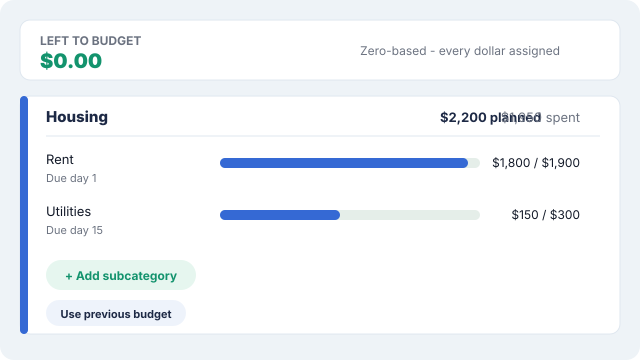
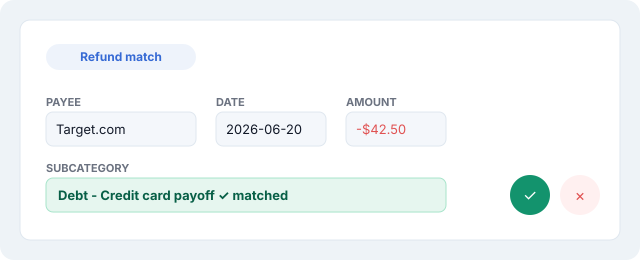
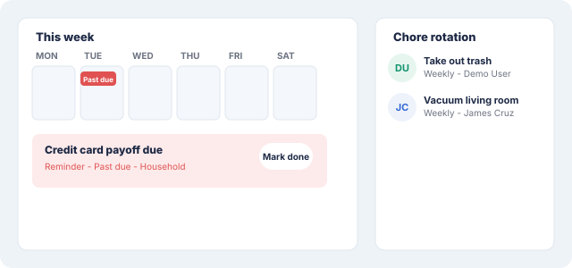
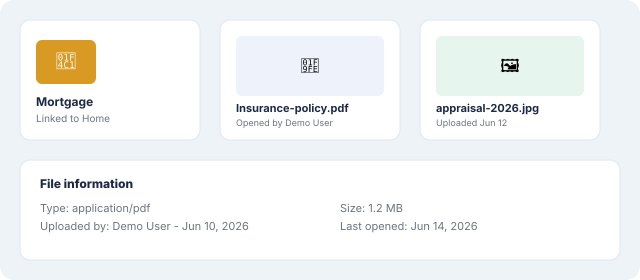
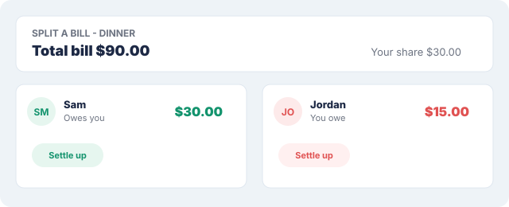
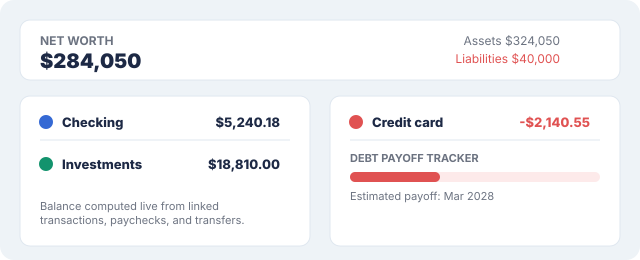
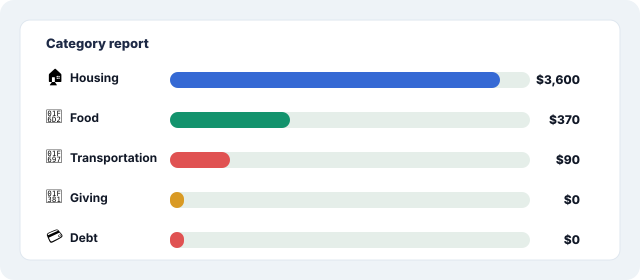

# FamilyLoop Consumer Guide

FamilyLoop brings household budgets, transactions, calendars, chores, meals,
goals, shared expenses, and family planning into one workspace. This guide
mirrors the step-by-step **Help** page inside the app (select **Help** in the
sidebar once signed in, or select **Help** on the sign-in screen itself if
you're not signed in yet — no account needed to read it) — use whichever is
more convenient.

## Contents

[Getting Started](#getting-started) · [Households](#households) ·
[Budget](#budget) · [Transactions](#transactions) ·
[Paycheck/Income](#paycheckincome) · [Calendar](#calendar) ·
[Notes](#notes) · [Journal](#journal) · [Plan](#plan) ·
[Documents](#documents) · [Decisions](#decisions) ·
[Shared Expenses](#shared-expenses) · [Meals and Recipes](#meals-and-recipes) ·
[Goals](#goals) · [Wealth](#wealth) · [Sharing](#sharing) ·
[Reports and Export](#reports-and-export) ·
[Invitations](#invitations) · [Password Recovery](#password-recovery) ·
[FAQ](#faq)

## Getting Started

1. Create an account and choose the household's country.
2. Add income in **Budget**, under **Add income**.
3. Create budget categories and subcategories (budget lines), each with a
   planned amount.
4. Add transactions and assign each one to a budget line.
5. Add calendar events, recurring chores, birthdays, meals, and goals as
   needed.

## Households

1. Open **Current household** in the sidebar to switch between homes — each
   one keeps entirely separate budgets, calendars, notes, and records.
2. Select **+ Add** to create another household (one per currency — you'll
   be blocked if you already have one in that currency).
3. Select **Set as default** to choose which household loads automatically
   the next time you sign in.
4. Select **Remove** to delete a household outright — blocked if it's your
   only one.

**Get the most out of it**
- Set as default is personal to you — it doesn't change what other members
  see when they sign in.
- Running two currencies (e.g. a home country and an overseas one)? That's
  exactly what a second household is for.

## Budget

1. First time in a month? Select **Start planning**, then add each paycheck
   under **Add income**.
2. Select **Add category** and type a name (e.g. Housing, Food, Debt).
3. Inside a category, select **+ Add subcategory** for each budget line
   (e.g. Rent, Groceries) and give it a planned amount.
4. Optionally set a due day on a bill-like line to get Calendar reminders
   and its own sinking-fund set-aside math.
5. As you assign transactions to a line (see Transactions below), **Spent**
   and **Remaining** update automatically — nothing to recalculate by hand.
6. Starting a new month? Use **Use previous budget** at the top of
   Categories and subcategories to copy last month's categories and amounts
   instead of rebuilding from scratch.

**Get the most out of it**
- Build out every category before you start assigning transactions — an
  unassigned transaction can't tell you if you're over or under budget in
  that area.
- "Left to budget" at the top should reach $0 once every dollar of income
  has a job — that's zero-based budgeting.
- Recurring bills (HOA, insurance, property tax, subscriptions) are worth
  marking as recurring so FamilyLoop sets aside savings for them every month
  instead of one big hit when the bill lands.

## Transactions

1. Use **+ Add transaction** for something you're entering by hand, or
   **+ Import CSV/PDF** to bring in a bank or credit-card statement.
2. Imported rows land in the **Bank Stream** review queue first — nothing
   counts until you accept or dismiss each one.
3. Pick the **Subcategory** (budget line) for each transaction so it counts
   toward that line's Spent total in Budget.
4. If you've linked a bank account under Wealth, also link the transaction
   to that account so its running balance stays accurate.
5. Select the ✓ to accept a Bank Stream row into the ledger, or × to
   dismiss it.

**Get the most out of it**
- A refund or return is auto-matched to its original purchase by payee,
  amount, and date, and pre-filled with that purchase's budget line — always
  double-check the suggested line before accepting, especially if it wasn't
  a confident match.
- "Possible duplicate" and "Possible transfer" pills flag likely re-imports
  and account-to-account movements (like a credit card payment from
  checking) before you accept them — use the ⇄ icon to move a transfer
  instead of counting it as an expense.
- Tag transactions (e.g. "Florida trip") to see them grouped together later
  in Reports.
- A new transaction's Subcategory **and** Wealth account are both pre-filled
  from how you (or a similar payee) were categorized/linked most recently,
  in both Bank Stream (a **From history** pill for Subcategory, an
  **Account from history** pill for the account) and the manual Add
  transaction form — always worth a glance before accepting, since it's a
  suggestion, not a guarantee.
- No history for a payee yet? Select **✨ Suggest with AI** for Subcategory,
  or **✨ Suggest account with AI** for the account (both on the Add
  transaction form, or their matching ✨ buttons next to an unlinked Bank
  Stream row) to have it pick from your real budget lines or Wealth
  accounts — only runs when you ask, one payee at a time, never
  automatically across a whole import.
- CSV import recognizes exports from Chase, Capital One, Wells Fargo,
  Discover, Amex, and Citi, among others — both plain checking-style files
  and credit-card-style files (positive = purchase) are detected
  automatically. PDF import recognizes both a monthly credit-card statement
  and a checking/deposit account's "Account Activity" print export (e.g.
  Bank of America's Online Banking print-to-PDF); a still-"Processing" row
  that hasn't posted yet imports dated today with a **Pending** pill, so it
  isn't lost — just correct the date once your bank posts it for real.
- An import auto-links to a Wealth account by matching its name against the
  file's own name (and, for a checking-account PDF, the account label
  printed on the statement itself, e.g. "Adv Plus Banking - 6769") — if that
  whole-file match comes up empty, each row still falls back to the
  per-payee account history/AI suggestion above; if nothing matches at all,
  use **Set account for all unlinked rows** above the list to assign one
  account to everything in a single action instead of picking it row by row.

## Paycheck/Income

1. In Budget, select **Add income** and name the paycheck (e.g. "Jordan's
   salary").
2. Set the amount and how often it repeats — one-time, bonus, weekly,
   biweekly, or monthly.
3. Use the assign form to route pieces of that paycheck to specific budget
   lines until it's fully assigned.
4. Optionally set **Deposit to account** (under Wealth) so that account's
   balance reflects the deposit automatically.

**Get the most out of it**
- Setting a deposit account means you don't need a matching manual
  transaction just to keep that account's balance right.
- The Paycheck page filters to unpaid paychecks sorted by how soon they're
  due, so you always see what needs assigning next first.

## Calendar

1. Add a chore with a repeat schedule (weekly, every 2/3/4/6 months, or
   yearly) — it rotates through the **Chore rotation** panel automatically.
2. Select **Complete** on a chore to reveal its next occurrence; anything
   overdue turns red as "Past due."
3. Add birthdays and anniversaries once — they recur every year
   automatically.
4. Set **Remind before** (or **Don't remind**) and **Remind me at** to
   control exactly when the reminder email fires, then select **Mark
   wished** once you've reached out.
5. Add a plain Reminder with its own independent remind time, fully separate
   from the event's own date — so a noon event can remind you an hour
   earlier.
6. Use the member chips above the grid to filter the whole calendar down to
   one person.

**Get the most out of it**
- Completed chores stay visible on the calendar grid instead of
  disappearing, so you can see what actually got done.
- Assign chores to different household members and rotate fairly —
  everyone sees only their own past-due items highlighted on Home.

## Notes

1. Create a note, give it a label and color, and add a checklist if it
   needs one.
2. Nest checklist items under a parent item for sub-steps — typing will
   suggest matches from items you've used before.
3. Select **Pin** on notes you check often so they stay at the top.
4. Select **Archive** once a note is done but might be useful again later.
5. Deleted notes move to Trash and are permanently removed after 7 days —
   recover one before then if needed.

**Get the most out of it**
- Drag checklist items to reorder them — handy for turning a note into a
  step-by-step list.

## Journal

1. Open Journal and add an entry for the day — mood, gratitude, tags,
   photos, and free text are all optional.
2. Use the AI reflection option for a short prompt back on what you wrote,
   if you'd find that helpful.
3. Browse past entries by date to see patterns over time.

**Get the most out of it**
- This is private to you — never shared with other household members, even
  ones with full access to everything else.

## Plan

1. Add a task with a start time and duration on the daily timeline.
2. Drag or resize a task block to adjust when it happens.
3. Log what actually happened afterward so Plan can compare planned versus
   actual.
4. Break a task into subtasks for anything with multiple steps.

**Get the most out of it**
- Like Journal, Plan is private to you alone — a personal planner, not a
  shared household calendar.

## Documents

1. Select **+ New folder** to organize files, or drag files/whole folders
   straight onto the page to upload.
2. Use the ⋮ menu on any file to open, download, rename, make a copy, view
   file information, move it, or delete it.
3. Link a folder or an individual document to a Note, or to a specific
   asset/liability in Wealth (for example, a mortgage folder linked to your
   home) so the paperwork behind a number is easy to find later.

**Get the most out of it**
- Documents are shared across every household you own, not just the one
  currently selected — so they don't disappear when you switch households.

## Decisions

1. Select **Add decision** and type the question you're weighing (e.g.
   "Should we move to a bigger apartment?").
2. Add notes for context, and attach any relevant files.
3. List out Pros and Cons together as they come up.
4. Once you've chosen, fill in what you decided and select **Mark
   decided** — you can always **Reopen** it later if things change.

**Get the most out of it**
- Decisions are shared across all your households too, just like Documents
  — a running family log, not tied to one specific household.

## Shared Expenses

1. Add people you split money with under **Friends** — add their email any
   time to send an invite.
2. Use **Record a debt** for a simple one-off — pick a person, an amount,
   and whether you owe them or they owe you.
3. Use **Split a bill with friends** when you paid the whole thing yourself
   — enter the total bill (including your own share), pick a split type
   (equal, exact amounts, percentage, or shares), and only your friends'
   portions get tracked as amounts owed to you.
4. Select **Settle up** against a person's running balance once they've
   paid you back (or you've paid them), for the full amount or a partial
   one.

**Get the most out of it**
- Assign a Ledger transaction directly to an IOU split (via the 👥 icon)
  when you're entering the original purchase, instead of creating the
  split separately afterward.

## Meals and Recipes

1. Save a reusable recipe under **Recipes** with its ingredients and
   nutrition info.
2. In **Meals**, drop a saved recipe into a day and slot on the weekly
   planner.
3. Use the grocery list built automatically from that week's planned
   ingredients.
4. Post the grocery list straight to a budget line when you're ready to
   shop.

**Get the most out of it**
- Build a small library of go-to recipes once — planning a week becomes
  picking from a list instead of starting from zero.

## Goals

1. Add a sinking fund with a name, a target amount, and optionally a target
   date.
2. Update **Saved so far** as you contribute — the progress bar and
   remaining balance recalculate automatically.

**Get the most out of it**
- Use Goals for anything you're saving toward outside a monthly bill —
  vacations, a big purchase, an emergency fund.

## Wealth

1. Add a real bank or credit-card **Account** with its opening balance.
2. Let the balance update itself from there on — it's computed live from
   linked transactions, paychecks, and transfers, never entered by hand.
3. Link an account to a **Net worth** asset or liability so that entry
   updates automatically as the account does.
4. For debt, check the **Debt payoff tracker** — it estimates a payoff date
   and suggested payment from the balance, rate, and term you enter.

**Get the most out of it**
- Move an account-to-account payment (like paying a credit card from
  checking) to a Transfer instead of leaving it as a regular expense/income
  pair — the ⇄ icon on a matched transaction does this in one step.
- Drag an account by its ⠿ handle to reorder the **Accounts** list — useful
  for putting the ones you check most often at the top.
- Under **Net worth**, a brokerage or 401(k) with several stocks or mutual
  funds shows as one card, not one row per symbol: use **+ Add multiple** to
  create it (enter the account name once, add a row per symbol, submit), and
  the card shows a chip per holding plus a combined market value. To add,
  edit, or remove individual holdings later, select **Manage list** on that
  card (or click any chip) instead of deleting and re-adding the whole
  account — clearing a row's symbol removes just that one holding, and a
  blank new row is skipped rather than erroring. **↻ Live price** on the
  card refreshes every holding in it at once.

## Sharing

1. Select **Invite**, choose a preset role (co-owner, adult, viewer, or
   meals/chores-only) or pick exact areas to share instead.
2. Send the one-time invite code to the person you're inviting.
3. Resend a new code any time theirs lapsed or was already used — a code is
   single-use.
4. Select **Revoke** next to any member in the list to remove their access.

**Get the most out of it**
- Pick "exact areas to share" instead of a preset role for anyone who
  should only see, say, Calendar and Chores and nothing about the
  household's money.

## Reports and Export

1. Choose a scope — month, date range, or whole year — from the toolbar at
   the top.
2. Review the cards: Budget vs Expense, Cash flow trend, Cash flow
   breakdown (the Sankey chart), Category report (an icon and bar per
   category, largest first), Category/Subcategory, and Tags.
3. Select any Sankey segment, category, subcategory, or tag to drill down
   into the exact transactions behind that number.
4. Use the header's download control to export whatever you're currently
   viewing as a file.

**Get the most out of it**
- If a refund never got matched to its purchase, that category's total
  will look higher than it really is until you assign the refund to the
  same budget line — see the Transactions tips above.

## Invitations

Household owners can choose which areas to share and send an invitation by
email.

- Use the exact email address that received the invitation.
- Open the direct acceptance link or select **Accept invitation** on the
  sign-in screen.
- Enter the one-time invite code.
- New users create a password of at least 12 characters.
- Existing users enter their current password.

Invitation codes become invalid after acceptance.

## Password Recovery

Select **Forgot password?** on the sign-in screen. FamilyLoop sends a
one-time reset link that expires after 30 minutes. Check Spam and All Mail
if the message does not appear in the inbox.

## FAQ

**Will I lose data if I remove a household?**
Yes — removing a household deletes all of its budget, transaction,
calendar, meal, goal, debt, and asset data, and it's blocked if it's your
only household. Documents and Decisions are unaffected either way, since
those belong to you personally, not to any one household.

**Why do I see the same Documents and Decisions in every household I own?**
Those two features are deliberately shared across every household you own,
not tied to one household — so your paperwork and family decisions don't
disappear or split apart when you switch households. Everything else
(budget, calendar, transactions, meals, and so on) stays separate per
household.

**Can other household members read my Journal or Plan?**
No. Both are private to you specifically, even for household members who
otherwise have full access to everything else.

**Why didn't my refund automatically match its purchase?**
Automatic matching needs an exact opposite amount, a similar payee name,
and a purchase dated within 180 days before the refund. If any of those
don't line up — a different amount, very different payee wording, or more
than 180 days apart — it won't auto-match. Pick the correct Subcategory
yourself on that Bank Stream row before accepting it.

**My budget category still shows money spent that I got refunded — why?**
A refund only offsets a category's spending once it's assigned to the same
budget line as the original purchase. An unmatched refund sitting
unassigned doesn't cancel anything out in that category's total, even
though your overall Cash flow total nets out correctly either way. Check
the Subcategory on that transaction.

**Why is my linked account's balance different from what I expected?**
A linked account's balance is always computed live from its real linked
transactions, paychecks, and transfers — never typed in by hand after the
opening balance. If it looks off, something real (a transaction, paycheck,
or transfer) probably isn't linked to that account yet.

**I lost my invitation email or code — what do I do?**
Ask the household owner to resend it from Sharing. A code is single-use,
and resending automatically replaces the old one.

**How long do I have to recover a deleted note?**
7 days in Trash — after that it's permanently removed.

**Can I run households in different currencies?**
Yes — FamilyLoop allows one household per currency. Switch between them
any time from Current household in the sidebar.

**Does a successful email mean the recipient definitely got it?**
Not quite — a successful send just means the email provider accepted the
message for delivery, not that it landed in the inbox. Check Spam and All
Mail if an expected email doesn't show up.

**What does Try demo actually give me access to?**
A temporary account with no reusable credentials and no administrator
access — safe to explore the whole app without setting anything up first.
